# Fursuit图像自动识别系统

<!-- PROJECT SHIELDS -->

[![Contributors][contributors-shield]][contributors-url]
[![Forks][forks-shield]][forks-url]
[![Stargazers][stars-shield]][stars-url]
[![Issues][issues-shield]][issues-url]
[![MIT License][license-shield]][license-url]

<!-- PROJECT LOGO -->
 

  
  <h3 align="center">Fursuit图像自动识别系统</h3>
  

    本系统通过对fursuit的面部特征进行提取与识别，利用库中已有照片进行图中所含角色的名称预测。
     
    <a href="https://github.com/nomyowo/FurryRecongnization"><strong>探索本项目的文档 »</strong></a>
     
     
    <a href="https://github.com/nomyowo/FurryRecongnization">查看Demo</a>
    ·
    <a href="https://github.com/nomyowo/FurryRecongnization/issues">报告Bug</a>
    ·
    <a href="https://github.com/nomyowo/FurryRecongnization/issues">提出新特性</a>
  

 本篇README.md面向展会策划者或喜欢furry的开发者，如果有什么好的建议和意见，欢迎随时与我交流OwO

QQ：1459644054

## 目录

- [Q&A环节](#Q&A环节)
- [使用方法](#使用方法)
  - [训练图库](#训练图库)
  - [单目标预测](#单目标预测)
  - [多目标预测](#多目标预测)
- [开发架构](#开发架构)
- [部署](#部署)
- [作者](#作者)
- [版权说明](#版权说明)
- [鸣谢](#鸣谢)

### Q&A环节

- #### 我不会部署系统，只是想试用一下这个系统，该怎么办呢？

我部署了一套系统在服务器上，大家可以访问[http://152.136.24.15:5000/](http://152.136.24.15:5000/)网站**免费**使用。系统含有三个功能：训练图库作用为上传兽装图片供模型学习，单目标预测作用为找到多张照片中含有输入名字毛毛的照片，多目标预测作用为标记处多张照片中所有毛毛的名字。也就是说，**单目标预测通常是为个人使用，多目标预测可以在小型兽聚、大型兽展上供主办方使用**

具体使用方法可以看下方“使用方法”章节所示。

> *注：因为此项目只是演示demo，因此并未对系统安全进行控制，请大家不要恶意删除照片，并不要随意使用库中的照片。*

- #### 这个系统有什么作用？

目前很多展会/小聚都会有专门的摄影老师给大家拍好看的图图，也会有一些小可爱喜欢给自己喜欢的毛毛照相或合照。但是当返图过多时，很容易忘记其中的一只或几只毛毛的名字，就无法将返图给到对应的毛毛（只能到处问问或发空间求助好友x）。

目前大多数展会都采取“照片直播”的方式给到返图，这种方式一是只能收集官摄的图片，二是很难在成百上千张照片中找到自己的毛毛。

因此我便开发了兽装自动识别系统，可以快速分类照片，帮助大家快速找到自己的返图！

- #### 这个系统怎么用？需要做什么准备？麻烦吗？

毕竟只是个人开发者，而且为了轻量化的使用，所以整个系统并不复杂，只需要一台有cpu有内存能联网的电脑/服务器便可以部署。目前还没有加入登录等多用户功能，~~但是会在不远的未来补充完整的（咕咕~~

对于使用系统来说，仅需要准备一个训练好的带furry标签的yolo模型（非盈利使用时可以直接联系我免费使用，~~如果盈利使用的话也可以给我提供一些训练数据换取yolo模型的使用权~~），即可进行部署。使用过程中，每一位毛毛只需要上传3~4张单人兽装照片，即可完成模型训练。无论是单人还是摄影只需要做完后期之后将返图丢入系统，即可完成返图的整理工作！

### 使用方法

运行系统，打开网页，主页包含训练图库、单目标预测、多目标预测三个功能，点击相应功能即可进入该模块。

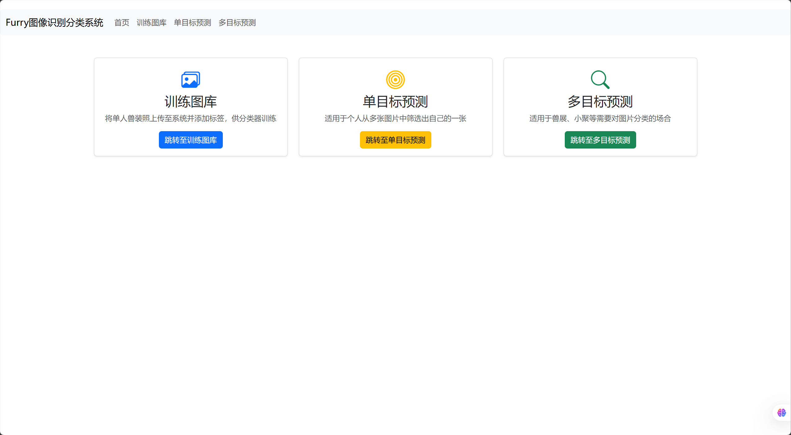

#### 训练图库

训练图库存储模型训练所需图像，为保证模型训练精度，请上传**仅包含该兽装的单人照**，使用步骤如下：

1. 点击“选择文件”按钮，打开文件选择界面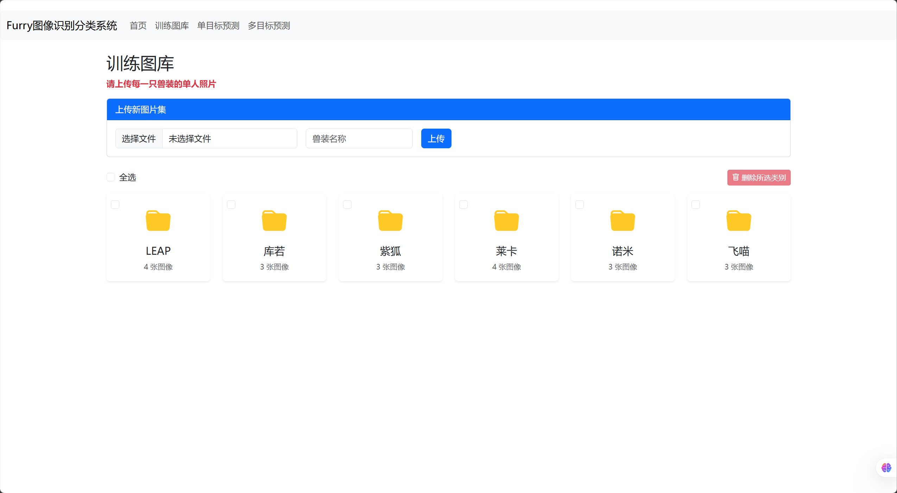
2. 选中所有需要添加的图片，点击“打开”按钮，上传图片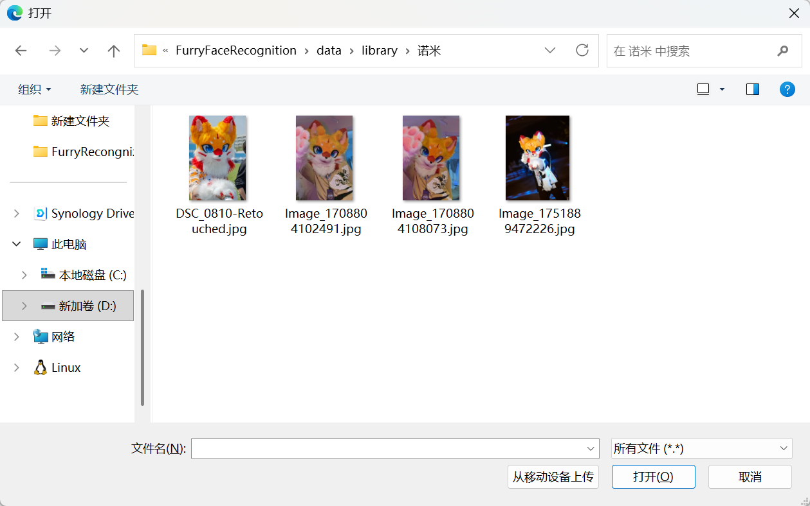
3. 在“兽装名称”框中输入该兽装名字，点击“上传”按钮，上传兽装图片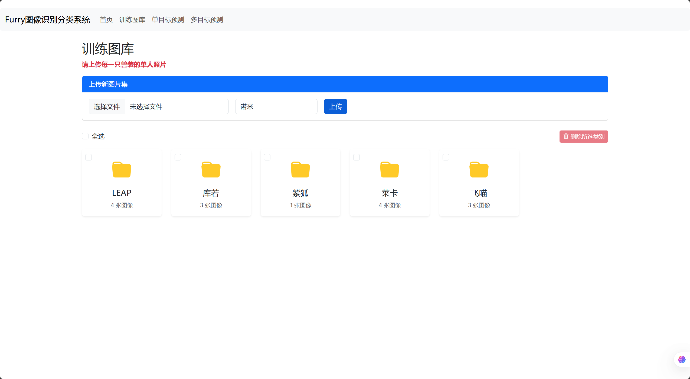
4. 等待模型重新训练后，即可完成兽装图片的上传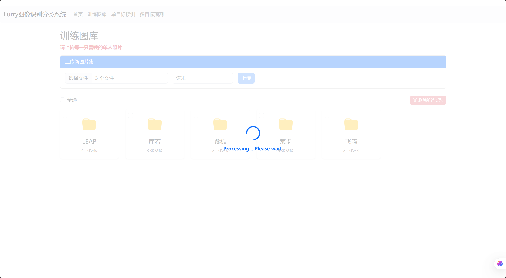
5. 点击该文件夹即可进入图片查看，此时可以通过按钮完成添加该类别图片及删除该类别图片操作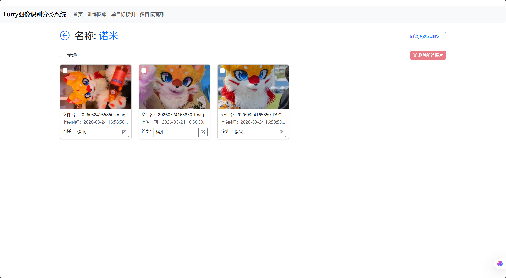
6. 若图片名称标记错误，可以点击名称框填写正确名字，修改后按回车或点击右侧按钮应用修改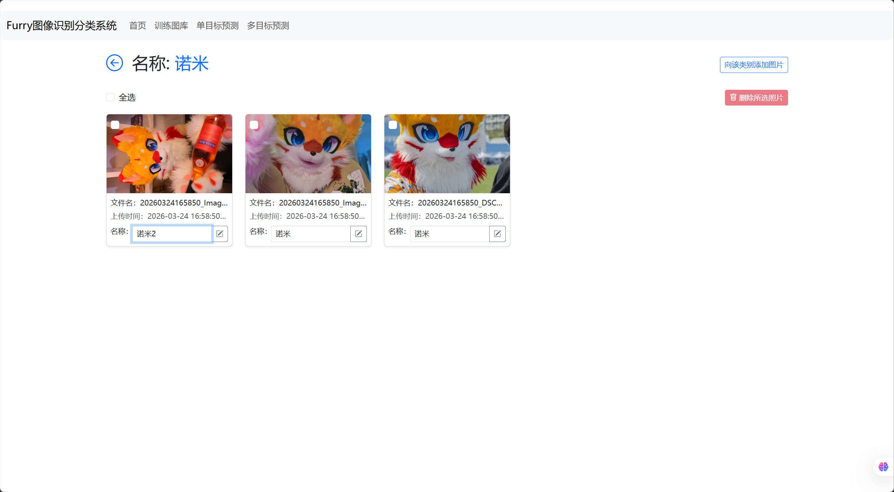

#### 单目标预测

单目标预测的主要功能为找到含有该毛毛的照片，用户可以自己调节筛选阈值快速下载含该毛毛的所有照片。

1、打开单目标预测界面，输入目标名称（**一定是已经在训练图库添加过图片和标签的毛毛**）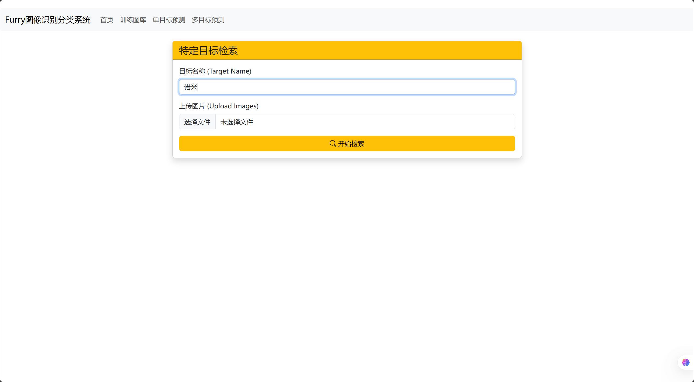

2、点击”选择文件“按钮，选择所需寻找的图片，点击”打开“上传

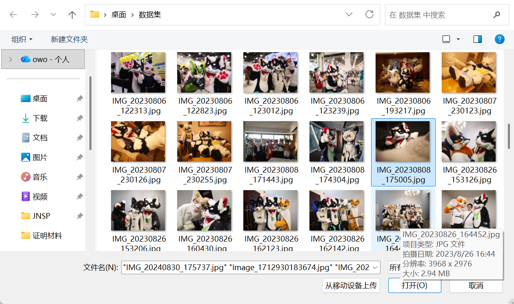

3、点击“开始检索”按钮，系统开始进行查找，查找结果将如下图所示

4、系统默认置信度阈值为0.85，即筛选出所有该名称置信度高于0.85的图片，用户也可以调整滑块（0.7-1.0区间滑动），调整筛选效果

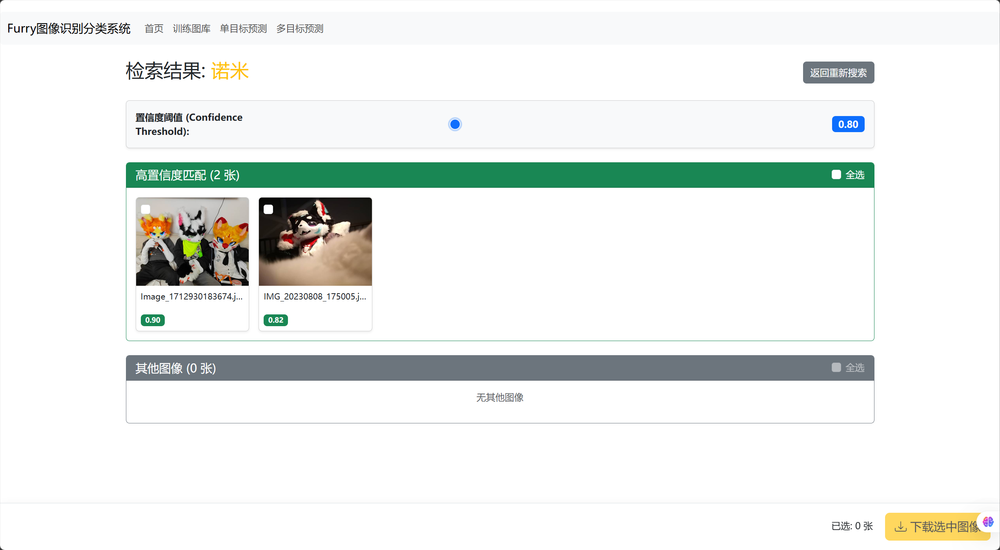

5、筛选后用户可以选择所有需要的图像，点击右下角“下载选中图像按钮”，下载原图到本地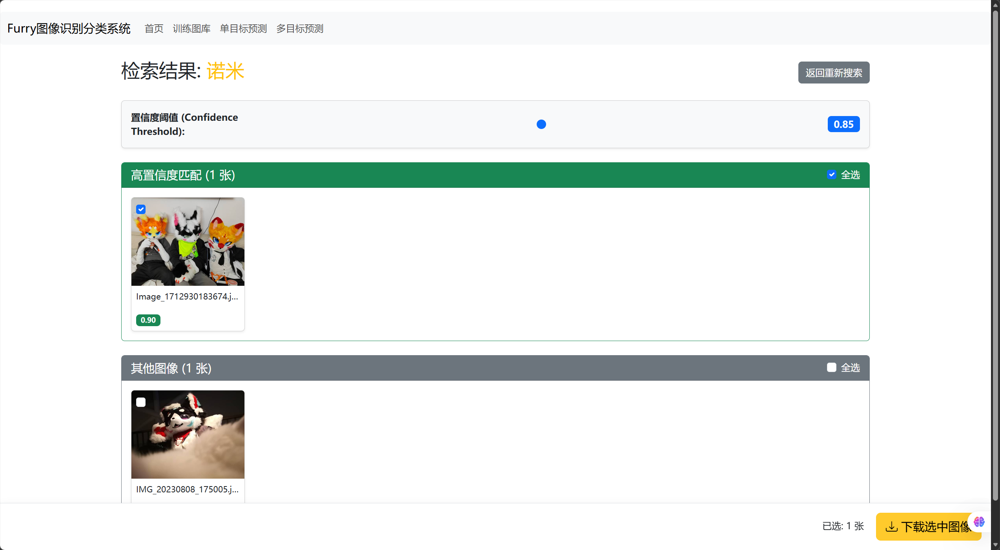

#### 多目标预测

预测图库主要功能为上传待预测的图片，并由系统自动预测结果，并提供下载接口，帮助用户下载分类后的返图。

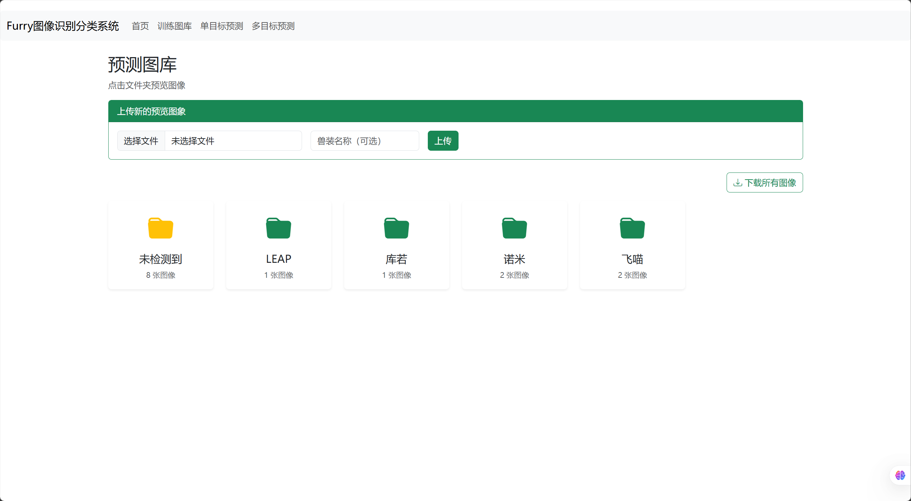

上传图片功能与训练图库相同，因此不再赘述，但其可以不添加兽装名称即可直接上传。

上传后的图片会默认放入“未检测到”文件夹内，点击文件夹即可看到图片。

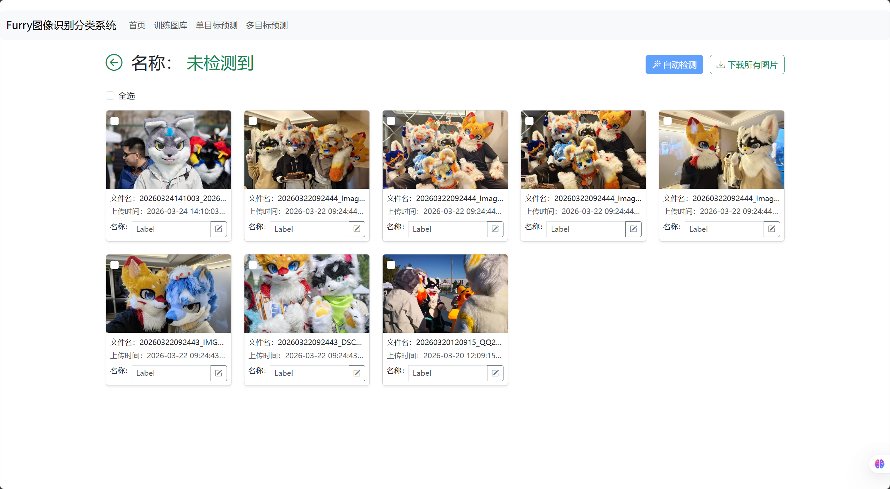

选择图片，点击“自动检测”按钮，即可自动检测图片中的兽装并返回结果，注意，**该结果只会包含库中已有的标签**

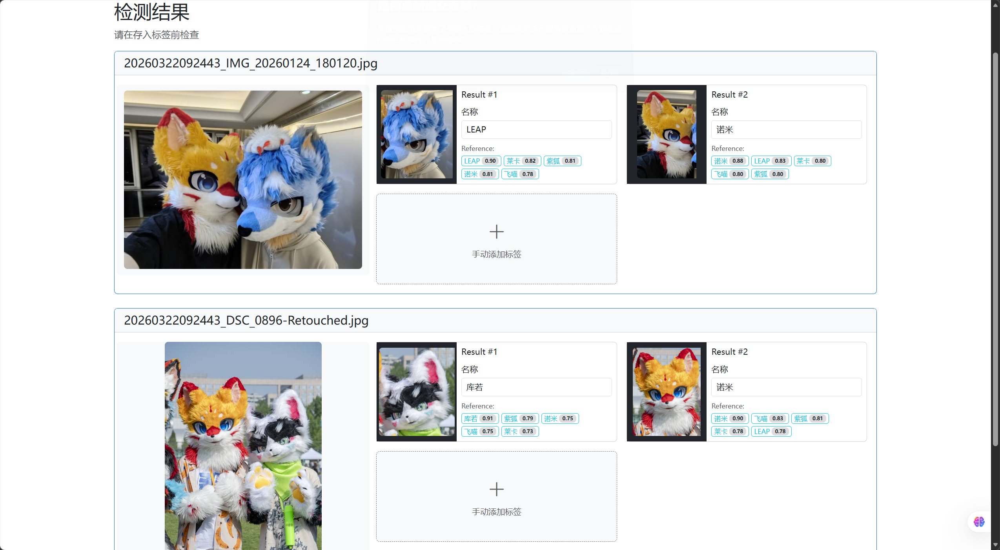

点击标签名称可以更换标签，点击原图像可以放大查看，也可以点击“手动添加标签”，手动为照片添加类别名称

修改确认完毕后，点击右下角“保存所有结果”按钮，保存所有标签，即可完成标签分类自动添加

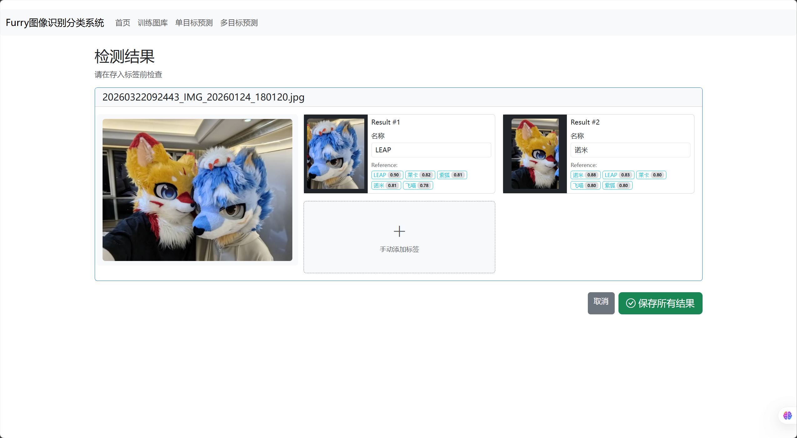

同样的，也可以通过手动修改标签的方式修改所属类别

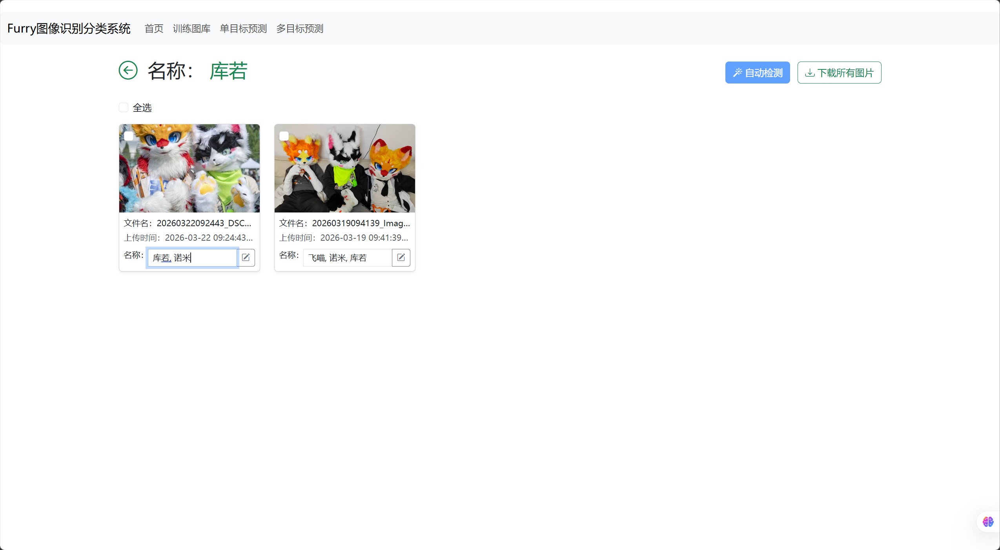

多人图像的各个标签会以“,”分割，该图像可以在每个所含标签的文件夹内看到

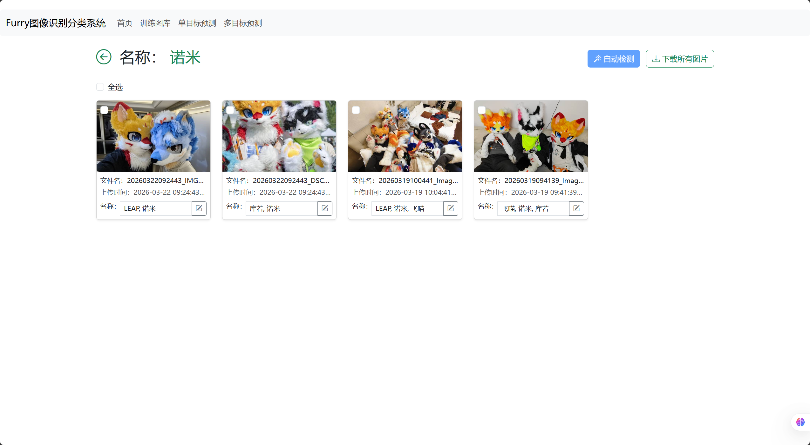

在主页点击“下载所有图像”按钮会下载库中所有图像，并按网页所示的方式分类放置所有图像

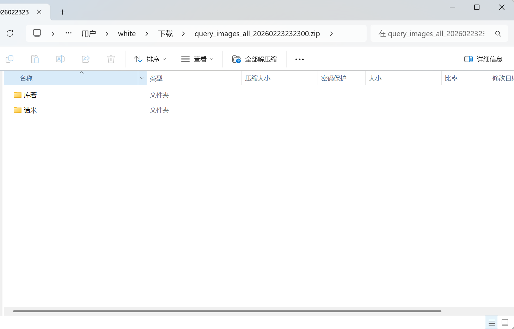

### 开发架构 

前端：HTML+Bootstrap

后端：python 3.13+fastapi

识别算法：yolo检测兽头+ResNet18分类检测

数据库：sqlite

### 部署

1. clone项目，创建python 3.13环境，根据requirements.txt文件下载依赖
2. 安装sqlite数据库，添加环境变量，创建数据库，并修改db.py文件中的“database.db”为自己的数据库文件名称
3. 将yolo权重模型放入项目中，修改classifier.py文件中“furry-03_best.pt”字段为自己的权重文件
4. 运行main.py文件，系统会创建数据库文件，并初始化系统，打开http://127.0.0.1:5000访问系统

### 作者

NomyOwO

QQ: 1459644054

### 版权说明

该项目签署了MIT 授权许可，详情请参阅 [LICENSE.txt](https://github.com/nomyowo/FurryRecongnization/blob/master/LICENSE.txt)

### 鸣谢

- 算法思路来源于[GarfieldQAQ/Dog-Face-Recognition: YOLOv12+ResNet+OneclassSVM+SVM](https://github.com/GarfieldQAQ/Dog-Face-Recognition)，感谢大佬的分享！
- readme文件模板来源于[shaojintian/Best_README_template: 🌩最好的中文README模板⚡️Best README template](https://github.com/shaojintian/Best_README_template)
- 以及我的好友们，愿意提供照片用以训练模型以及帮忙测试系统！

<!-- links -->

[your-project-path]:nomyowo/FurryRecongnization
[contributors-shield]: https://img.shields.io/github/contributors/nomyowo/FurryRecongnization.svg?style=flat-square
[contributors-url]: https://github.com/nomyowo/FurryRecongnization/graphs/contributors
[forks-shield]: https://img.shields.io/github/forks/nomyowo/FurryRecongnization.svg?style=flat-square
[forks-url]: https://github.com/nomyowo/FurryRecongnization/network/members
[stars-shield]: https://img.shields.io/github/stars/nomyowo/FurryRecongnization.svg?style=flat-square
[stars-url]: https://github.com/nomyowo/FurryRecongnization/stargazers
[issues-shield]: https://img.shields.io/github/issues/nomyowo/FurryRecongnization.svg?style=flat-square
[issues-url]: https://img.shields.io/github/issues/nomyowo/FurryRecongnization.svg
[license-shield]: https://img.shields.io/github/license/nomyowo/FurryRecongnization.svg?style=flat-square
[license-url]: https://github.com/nomyowo/FurryRecongnization/blob/master/LICENSE.txt
[linkedin-shield]: https://img.shields.io/badge/-LinkedIn-black.svg?style=flat-square&logo=linkedin&colorB=555
[linkedin-url]: https://linkedin.com/in/shaojintian

